## Black Box

Приложение позволяющее вести звукозапись в обычном и фоновом режиме, создавать расписания включения звукозаписи в фоновом режиме, так же поддерживает, резервное копирование в облачное хранилище,
Шифрование БД и активацию звукозаписи при помощи комбинации клавиш

Sing In

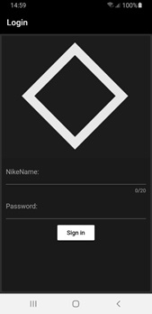
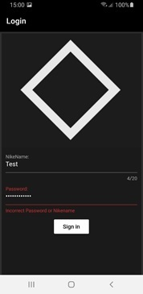

После авторизации приложения вы перейдёте на Главную страницу. В правом нижнем углу присутствует кнопка для начала записи, при нажатии на неё индикатор сверху будет соответствовать громкости звуков, которые он записывает

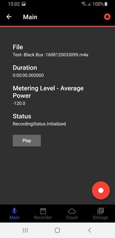
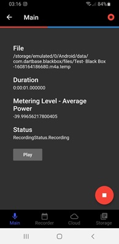
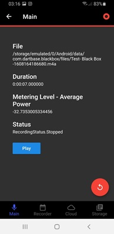

Перейдя на следующую вкладку, пользователь увидит следующую форму для установки Времени и периода записи в фоновом режиме

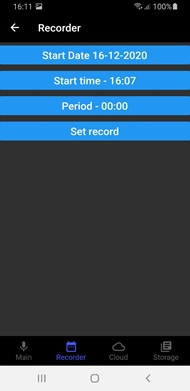

Работа с данной формой происходит следующим образом

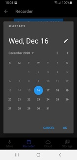
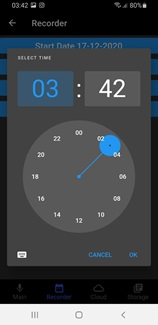
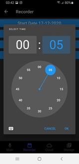

Сначало выбираем дату начала, после точное время и период (время длительности записи)

После заполнения формы такой формы и нажатия на кнопку «Set record», вы получите уведомление, которое сигнализирует о начале записи и её длительности в том момент времени, который вы указали на 3-м слайде.

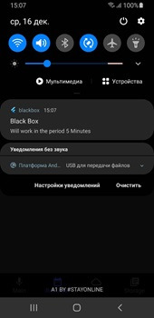

Следующий пункт меню представляет собой облачное хранилище. После прохождения авторизации и предоставления доступа вы сможете его использовать.

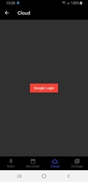

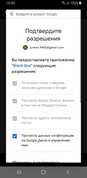
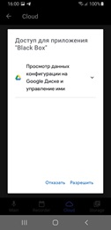
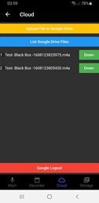

Далее «Storage» список в котором отображаются все аудиозаписи пользователя. Для действия на ними свапните элемент влево для воспроизведения, вправо для удаления.

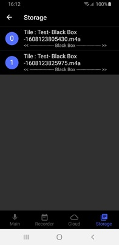
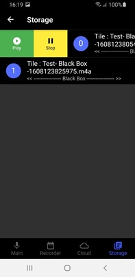
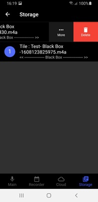

Дополнительный функционал доступен пользователю после нажатия на кнопку в правом верхнем углу «Main». После нажатия на неё, все последующие нажатия пользователя на кнопки звука ( + , - ) будет обрабатывать само приложение. При зажатии клавиши вверх, до упора (3 сек), начнётся запись. Которую можно остановить обратным действием, зажать кнопку вниз. Данная комбинация для активации записи в фоновом режиме работает и при Блокировке экрана

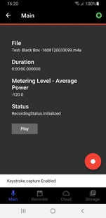
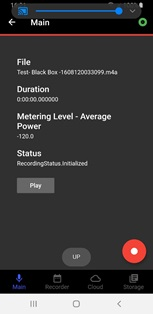
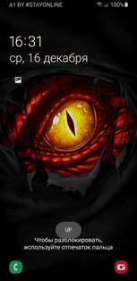
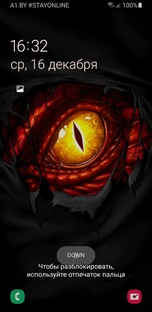

«Key Сombination»

> Подробное описание работы проекта и программной защиты (хранение и шифрование) находится в Zapiska.docx
> В разделе "Руководство пользователя"
